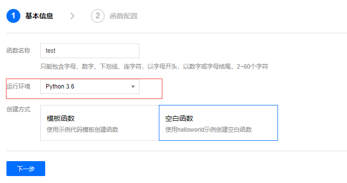

# 西安电子科技大学晨午晚检自动填报工具

本代码参考[HPShark/xdu_chenwuwanjian.git](https://github.com/HPShark/xdu_chenwuwanjian)和[abadfox233/ncov](https://github.com/abadfox233/ncov), [cunzao/ncov](https://github.com/cunzao/ncov)的作品。感谢大佬们的无私奉献。本代码仅供学术交流。

2020-08-26 更新日志：

1. 更人性化的设计：程序启动时立即上报一次。

2. 每天晚上随机初始化下一天上报的时刻，以避免多人同时使用对服务器的负载压力。

3. 上报失败时，自动尝试重新上报(最大次数3次)；新增了每次上报后的冷却(cd)时间为180秒。

4. 除了南北校区外，新增了在校外的地点选择(出差/旅游模式)。

5. 支持自由选择是否开启夜间睡眠模式，更加低碳环保。

2020-08-27 更新日志：

1. 优化了代码逻辑结构，主函数更简洁。

2. 程序启动时自动检查是否可以联网，并根据需要抛出异常。

3. 每小时输出一次当前时刻(夜间免打扰时间段除外)，以便用户确认程序在正常运行，使用体验更棒。

2020-09-02 更新日志：

1. 更简洁的功能设计，本地运行时，无需额外编辑配置即可一键运行。

2. 本地使用时，输入学工号自动判断`教职工`/`本科生`/`研究生`，并支持根据学院自动识别南北校区的定位。

3. 增强了隐私保护特性。

   - 用户可自由选择在硬盘存储用户名密码，或者首次运行时输入(不保存在硬盘)，输入密码后自动清屏(可支持windows和linux平台)。

   - 即使在不保存密码的情况下，也支持第一次使用之后默认开通免密登录。

   - 登录后立即销毁内存空间中的密码，采用逐字节擦写技术，更大限度的隐私保护。

4. 优化了代码运行的运行逻辑，尽可能的减少了对计算资源和网络带宽的开销。

5. 将层文件改为链接下载的方式，更节省git代码版本控制的资源开销。

## 项目依赖

* python >= 3
* requests 库

## 使用方法

### Step 1 环境配置：在python下安装requests库

Linux系统：

```bash
pip3 install requests -i https://pypi.tuna.tsinghua.edu.cn/simple
```

Windows系统：

```bash
pip install requests -i https://pypi.tuna.tsinghua.edu.cn/simple
```

### Step 2 下载本代码，然后运行

Linux系统：

```bash
python3 index.py
```

Windows系统：

```bash
python index.py
```

### 配合腾讯云函数使用（免费）

没有云服务器的情况下，可以使用腾讯云函数。

1. 打开[腾讯云函数](https://console.cloud.tencent.com/scf/index?rid=1)，注册认证后，进入控制台，点击左边的层，然后点新建，名称随意，然后点击上传zip，选择[`层文件.zip`](https://github.com/cunzao/ncov/blob/master/%E5%B1%82%E6%96%87%E4%BB%B6.zip)上传，然后选择运行环境`python3.6`，然后点击确定，耐心等待一下，上传依赖包需要花费的时间比较长 

2. 

3. 点左边的函数服务，新建云函数，名称随意，运行环境选择`python3.6`，创建方式选择空白函数，然后点击下一步 

   

4. 修改配置文件(`data/config.json`)

   进入源代码所在路径，将`./data/config.json.bak`重命名为`./data/config.json`，然后使用vim或notepad++等文本编辑器编辑这个文件，格式如下：

   > python 字典的语法, '//'以后为注释。各个参数与选项皆已列出,每一项都是必填字段

   ```python
   {
      "stuNum" : "123456789",   // 学号or工号
      "passWord" : "12345678",  // 密码
      "Location" : 0,           // [非必填] 定位信息：0：自动识别，1：北校区，2：南校区，其他：在校外。不写的话也会自动识别。注意不要带引号，这里必须是一个整数变量。
      "ServerToken" : ""        // [非必填] server酱的token，用于消息提醒
   }
   ```

   (可选) server酱问题：使用server酱进行通知，先前往[server酱官网](http://sc.ftqq.com/)进行申请与绑定，得到一个server酱的Token，将此Token替换`config.json`里的token

4. 修改`执行方法`为：`index.index`，提交方法选择上传本地压缩包，把本地的`/data`，`/utils`，`index.py`, `functions.py`打包上传，在点击下面的高级设置，设置内存为64M，超时时间为`30秒`，添加层为刚刚新建的函数依赖层，然后点击完成

   

5. 进入新建好的云函数，左边点击触发管理，点击创建触发器，名称随意，触发周期选择自定义，然后配置cron表达式。下面的表达式表示每天八点半，十三点半和十八点半执行

   ```
   0 30 8,13,18 * * * *
   ```

6. 然后就可以测试云函数了，绿色代表云函数执行成功，红色代表云函数执行失败（失败的原因大部分是由于依赖造成的）。如遇到问题，请仔细查看日志，欢迎提ISSUE

7. Enjoy it!

### 服务器使用

有自己的服务器的时候可以使用这个方法。

配置好配置文件(`data/config.json`)后运行：

```bash
python3 index.py
```

至于如何后台运行请[百度一下](http://www.baidu.com/)
